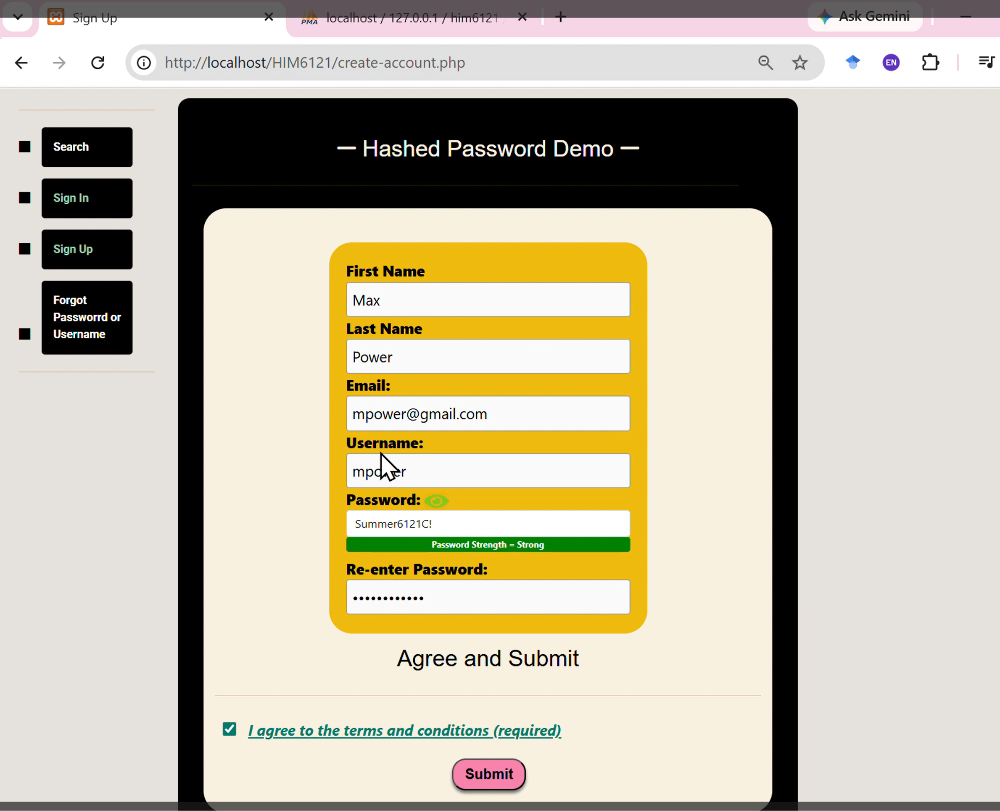
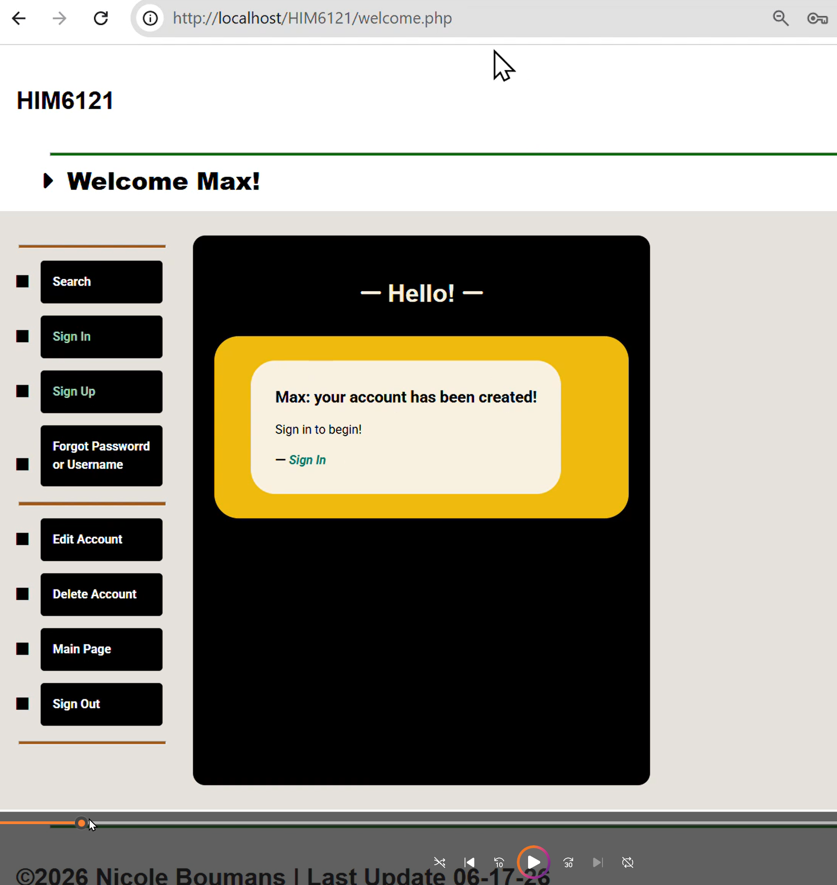
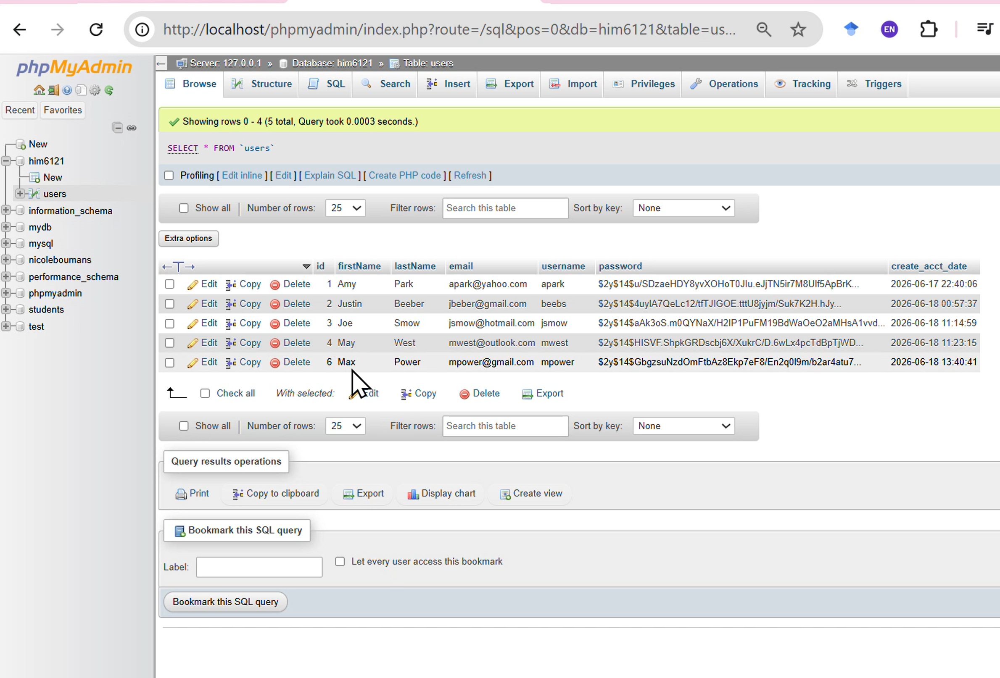

# Hash Digest: Password Hashing Demo (PHP + MySQL + phpMyAdmin)

This project demonstrates how secure password hashing works behind the scenes when a user creates an account. It walks through the full flow:

1. User submits a registration form  
2. PHP hashes the password using `password_hash()`  
3. The hashed password is stored in a MySQL database  
4. phpMyAdmin displays the stored hash  
5. The hash is broken down into its components (algorithm, cost, salt, hash)

All users shown in this demo are fictitious and used only for educational purposes.

---

## Why This Matters

- When a password is stored in a database, **the actual password is never saved**.  
- Instead, it is transformed using a **one‑way hashing function**.
- You can verify a password, but you cannot reverse the hash to recover the original password.

- This is a core concept in secure backend development, authentication systems, and healthcare applications where PHI must be protected.

---

## Understanding a Bcrypt Hash

A typical bcrypt hash looks like this:

$2y$14$GbgszNuZdOmFtbAz8Ekp7eF/En2q0lgm/b2ar4tu7...

Here’s how to read it:

- **`$2y$`** → hashing algorithm (bcrypt)  
- **`14`** → cost factor (2¹⁴ rounds of hashing)  
- **Next 22 characters** → random salt  
- **Remaining characters** → hashed password  

The salt ensures that even identical passwords produce different hashes.  
The cost factor controls how computationally expensive hashing is.
Increasing the cost factor improves security but slows down performance.

---

## Demo Flow

### 1. User fills out the registration form  

### 2. Account creation confirmation  

### 3. phpMyAdmin shows the stored hashed password  

---
## Demo Video

[Click to watch the Hash Digest demo](https://1drv.ms/v/c/ac093eb261348098/IQDs0ZEG3liKTpL7gC7bX4LFAZcTovmNnwfVaHRIFnKAcm0)

## Tech Stack

- **PHP** — password hashing using `password_hash()`  
- **MySQL** — user table + stored hash  
- **phpMyAdmin** — database inspection  
- **HTML/CSS** — create-account.php, welcome.php 
- **Localhost environment** — demo setup  

---

## Project Structure

/hash-discord 

│ 

├── /screenshots │    

│	 ├── form.png │     

│ 	├── welcome.png │     

│ 	└── database.png 

├── README.md

---

## References

1. **Passlib Documentation — BCrypt**  
   https://passlib.readthedocs.io/en/stable/lib/passlib.hash.bcrypt.html

2. **PHP Manual — `password_hash()`**  
   https://www.php.net/manual/en/function.password-hash.php
